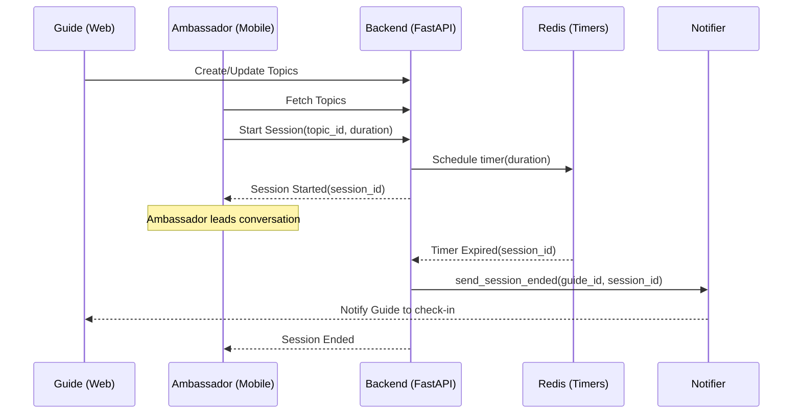
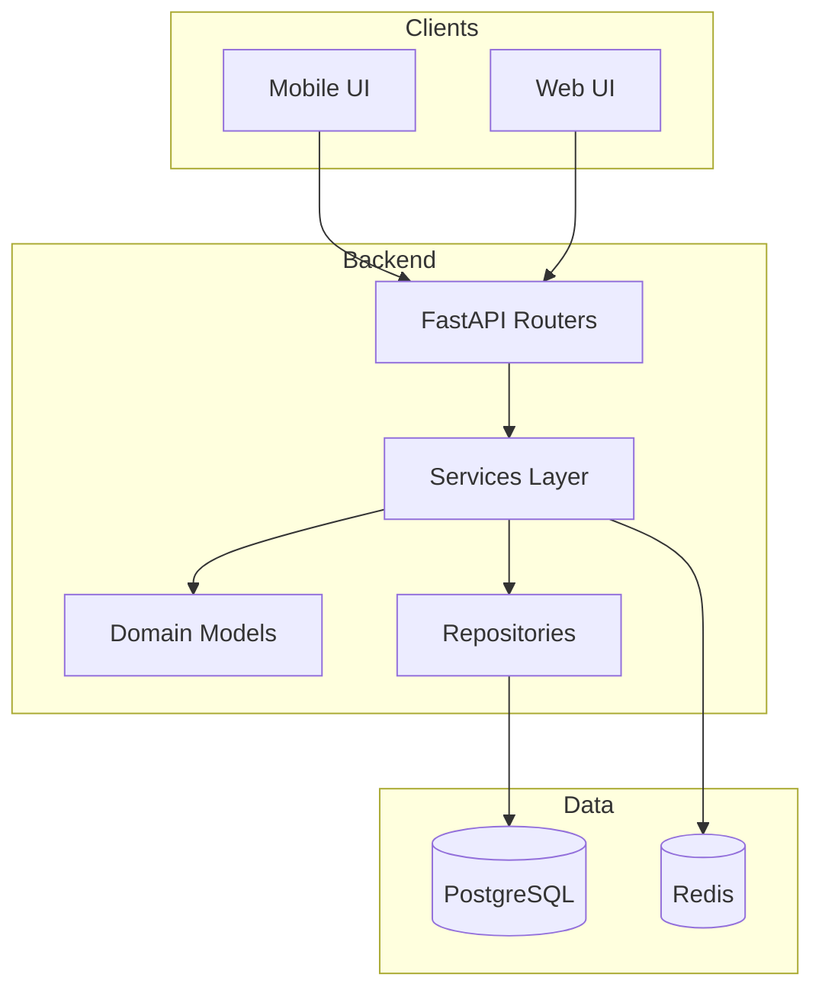
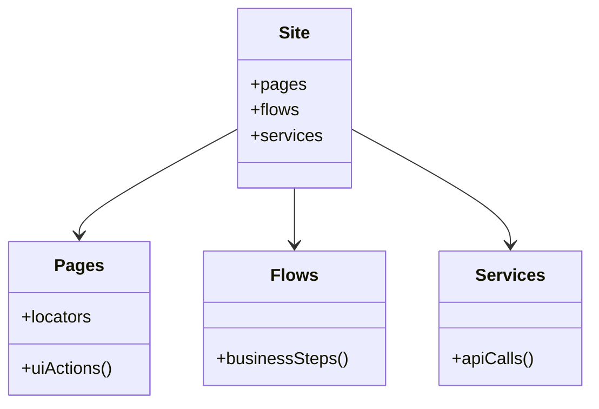

# ACE Technical Overview

ACE (Application for Conversation Escape) is a platform for **time-boxed conversations** between an **Ambassador** and a **Guest**, coordinated by a **Guide**.
This document is the technical “north star” for engineering and agents.

---

## System Context

```mermaid
flowchart LR
  Guide[Guide (Controller)] -->|configures topics & limits| Web[Web Dashboard]
  Ambassador[Ambassador (Talk Lead)] --> Mobile[Mobile App]
  Guest[Guest (Participant)] --> Mobile
  Web --> API[FastAPI Backend]
  Mobile --> API
  API --> PG[(PostgreSQL)]
  API --> Redis[(Redis)]
  API --> Notify[Notification Service]
  Notify --> Guide
```

---

## Core Conversation Flow



---

## Clean Architecture (Practical)



---

## Testing Strategy (Saturday-Style)

### E2E Site-Centric Facade


### Test Pyramid
```mermaid
flowchart TB
  Unit[Unit Tests (Vitest/Pytest)] --> Component[Component Tests (Vitest)]
  Component --> Integration[Integration Tests (API/DB)]
  Integration --> E2E[E2E (Playwright)]
```

---

## ML / Visual Validation Roadmap

```mermaid
flowchart TD
  A[Test Run] --> B[Capture Screenshot]
  B --> C[Write Metadata]
  C --> D[Preprocess]
  D --> E[Train Model]
  E --> F[Register Model (versioned)]
  B --> G[Detection]
  F --> G
  G --> H[Validation Result]
  H --> I[Dashboard Insights]
```

---

## Conventions

- All artifacts written to:
  - `reports/screenshots/...`
  - `reports/ml/metadata/...`
  - `ml-models/<detector>/<version>/...`

- All major decisions tracked in `docs/ADRs/`.

